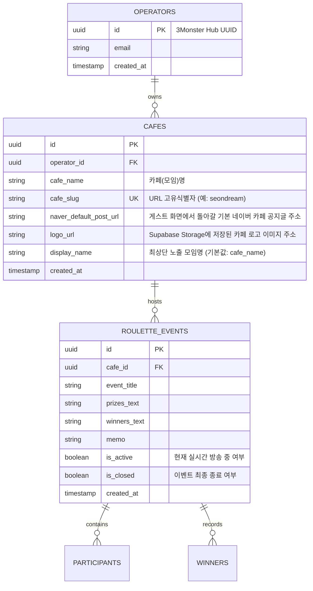

# 룰렛 서비스의 SaaS 플랫폼 전환 설계 및 아키텍처 계획

본 계획서는 현재 단일 이벤트 방식의 룰렛 서비스에서 누구나 계정을 생성하고 본인의 카페(모임) 이벤트를 개최하며, 게스트는 접속하여 원하는 카페(모임)를 찾아 라이브 게임을 시청하고 과거 기록을 조회할 수 있는 **SaaS(Software as a Service) 플랫폼**으로 확장하기 위한 기술적 아키텍처와 상세 계획을 다룹니다.

---

## 1. 핵심 아키텍처 요구사항
1. **다중 테넌트(Multi-tenant) 모델:** 여러 운영자(카페 및 모임)가 독립적인 데이터 영역을 가지며 각각 로그인하여 계정을 관리합니다.
2. **3Monster 허브 계정 통합:** 신규 회원가입/인증은 기존 **3Monster 허브 앱의 이메일 인증 API**와 연동하여 토큰 검증 방식을 도입하고, **3Monster 도메인의 서브도메인(예: `roulette.3monster.com`)**을 생성하여 세팅합니다.
3. **포털형 게스트 진입:** 로그인 없이 게스트가 포털 페이지에 진입하여 활성화된 **카페(모임)를 검색**하고 들어갑니다.
4. **마케팅 지향적 공개 노출:** 서비스 홍보 및 트래픽 유입 극대화를 위해 기본적으로 **모든 카페(모임)의 당첨 기록과 진행 상황은 포털에 공개(Public)로 노출**됩니다.
5. **네이버 카페 글 점프 기능:** 회원들이 룰렛 화면에서 원래 공지를 보고 찾아왔던 **네이버 카페 공지글 URL로 즉시 역이동(점핑)**할 수 있는 네비게이션 버튼을 라이브 화면 최상단에 제공합니다.
6. **URL 라우팅 체계화:** 각 카페가 고유의 고유 주소(Slug)를 가지고 서비스가 연결됩니다.

---

## 2. 데이터베이스 설계 변경안 (Supabase & SQLite)

기존의 `events` 테이블 중심 단일 구조에서, 다중 운영자 및 카페를 식별할 수 있는 확장된 릴레이션 스키마로 이전합니다.

---

## 3. 상세 구현 계획

### 3.1 회원가입 & 로그인 (운영자)
- **3Monster Hub 연동:** 운영자 세션 관리는 3Monster 허브 계정의 이메일 인증 토큰을 전달받아 검증 및 동기화합니다.
- **운영자 대시보드:** 인증 완료 후 `/operator/dashboard`로 리다이렉트되어 자신의 카페(모임) 설정 및 이벤트 목록을 확인합니다.

### 3.2 게스트 포털 페이지 (랜딩 페이지)
- **live_portal.html**
  - 누구나 접속 가능한 메인 랜딩 페이지.
  - **카페(모임) 검색창:** 네이버 카페명 또는 슛타임 URL 식별자(Slug) 검색 기능 제공. (차별화 포인트 강조: 다양한 티켓 수 분배 기능, 무인 연속 자동 추첨, 스마트 명단 정리 등 설명 배너 포함)
  - **실시간 라이브 목록:** 현재 실시간으로 진행 중(`is_active = true`)인 카페(모임) 룰렛 방송 리스트를 노출.
  - **통합 히스토리:** 최근 종료된 이벤트들의 당첨 결과 모아보기.

### 3.3 URL 라우팅 체계 설계
- **랜딩/포털:** `/` (검색 및 전체 라이브 목록)
- **게스트 뷰어:** `/live/<cafe_slug>` (해당 카페의 실시간 라이브 화면)
- **운영자 대시보드:** `/operator/dashboard` (세션 확인 후 자신의 카페 목록/설정 제어)
- **이벤트 히스토리:** `/history/<cafe_slug>` (해당 카페가 진행한 과거 당첨 결과 아카이브)

### 3.4 최상단 로고 및 모임명 직관적 인라인 편집
- **인라인 편집 (Inline Edit):**
  - 운영자 화면 최상단 타이틀 좌측 영역에 로고 이미지와 모임명(Display Name)을 노출합니다.
  - 운영자는 모임명 텍스트를 클릭하면 즉시 입력 폼으로 변환되어 수정할 수 있습니다.
  - 로고 이미지 영역을 더블 클릭하거나 편집 단추를 누르면 파일 업로드 다이얼로그가 열리며, 선택한 이미지는 **Supabase Storage 버킷**에 비동기 업로드되어 고유 URL로 변환 및 저장됩니다.
  - 별도의 설정 탭으로 갈 필요 없이, **해당 위치에서 수정 후 바로 저장 버튼이 활성화되어 DB(Supabase)에 반영**되도록 직관적인 뷰-에디터 전환 구조로 개발합니다.
  - 저장 완료 시 게스트 화면에도 실시간 소켓 통신을 통해 로고와 모임명이 실시간 업데이트됩니다.

### 3.5 네이버 카페 원본 공지글 이동 단추
- **원래 페이지로 돌아가기:** 게스트 화면 최상단 헤더 우측 혹은 특정 눈에 띄는 영역에 `[공지글 확인하기]` 또는 `[카페로 돌아가기]` 단추를 노출합니다.
- 해당 버튼을 누르면 운영자가 등록한 `naver_default_post_url` 주소로 즉각 새창 이동하여, 룰렛을 즐긴 회원들이 다시 원래 카페 활동 영역으로 복귀할 수 있도록 사용자 경로를 순환시킵니다.

---

## 4. 의사결정 사항 정리 (Merlin's Decisions)

1. **실시간 소켓 격리 방식:**
   - Socket.IO의 Room 기능 (`join_room(cafe_slug)`)을 사용해 카페(모임)별 통신망을 물리적으로 격리하여 타 사용자 정보 혼선 방지 (확정).
2. **공개 정책:**
   - 트래픽 확보 및 플랫폼 홍보를 위해 기본적으로 '전체 공개' 원칙 적용. 추후 보안이 필요한 특수 모임을 위해 비공개 옵션(예: 비밀번호 진입 또는 유료 비공개 전환) 확장 가능성 열어둠 (확정).
3. **네이버 카페 스크래핑 설정:**
   - 운영자 대시보드의 '카페 프로필 설정'에 스크래핑에 필요한 고유 카페 ID와 기본 수집 글 주소 양식을 제공받아 처리 (확정).
4. **로고 이미지 저장소:**
   - Supabase Storage 버킷에 로고 이미지 파일을 실시간 업로드 및 저장하고, 발급된 퍼블릭 CDN URL을 카페 테이블 `logo_url`로 맵핑 (확정).
